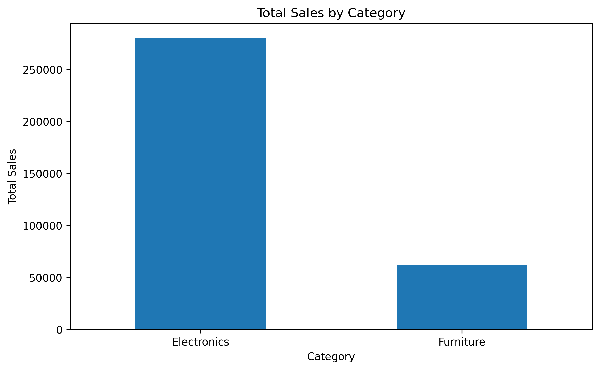
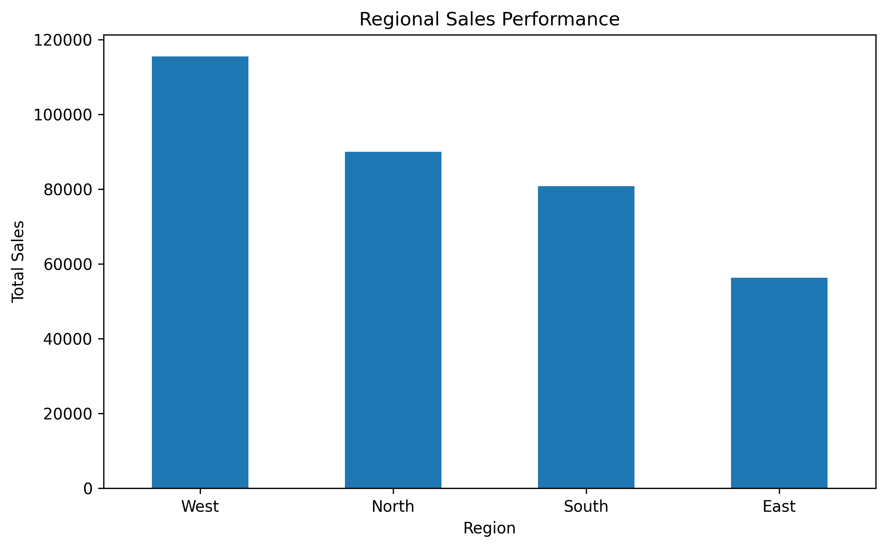
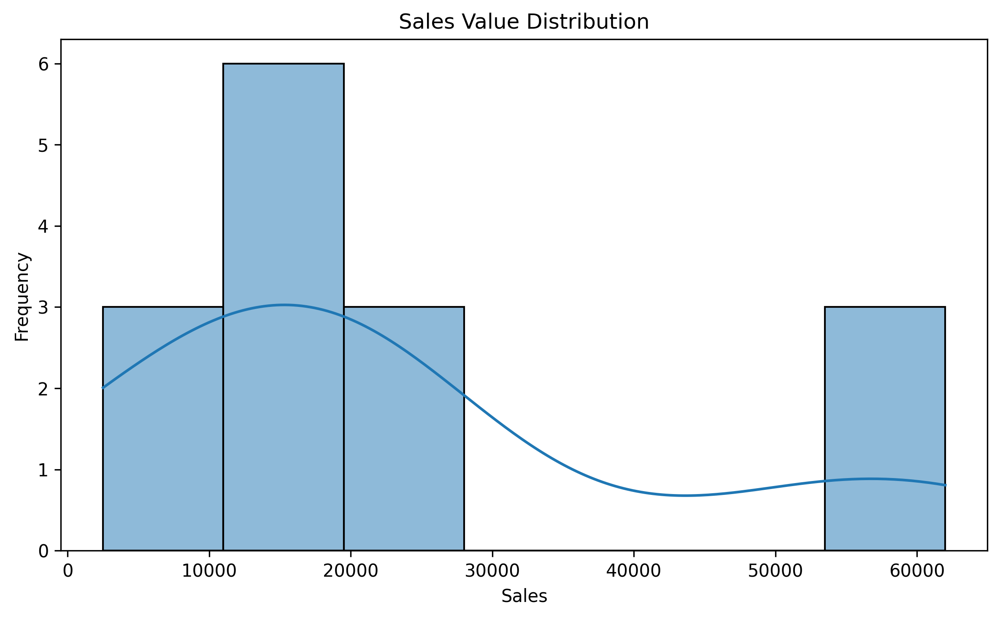
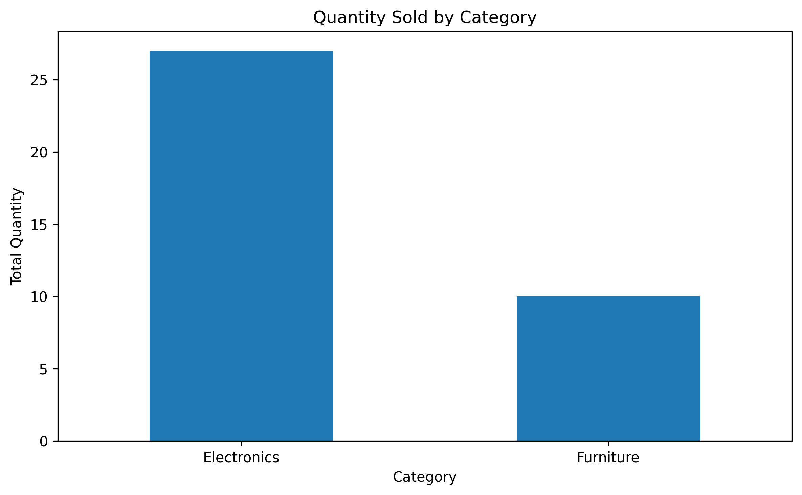

# Data Cleaning & Reporting Automation

## 📌 Project Overview

This project demonstrates an automated data cleaning and reporting workflow using Python.

The project processes a retail sales dataset and identifies common data quality issues such as missing values, duplicate records, inconsistent text formatting, and invalid data. The dataset is then cleaned, validated, exported to Excel, and analyzed using visualizations.

The main purpose of this project is to demonstrate how Python can automate repetitive data cleaning and reporting tasks.

---

## 🎯 Objectives

The objectives of this project are to:

- Load and inspect raw retail sales data
- Identify missing values
- Detect and remove duplicate records
- Standardize inconsistent text and categorical values
- Validate date and numerical fields
- Automate the data cleaning process
- Generate a data quality report
- Export the cleaned dataset to Excel
- Create visual summaries for data analysis

---

## 🛠️ Technologies Used

| Technology | Purpose |
|---|---|
| Python | Data processing and automation |
| Pandas | Data cleaning and analysis |
| NumPy | Numerical operations |
| Matplotlib | Data visualization |
| Seaborn | Statistical visualization |
| Microsoft Excel | Data storage and automated reporting |
| Jupyter Notebook | Development and execution environment |

---

# 🔄 Project Workflow

```text
Raw Excel Dataset
       │
       ▼
Data Loading
       │
       ▼
Initial Data Inspection
       │
       ▼
Data Quality Assessment
       │
       ├── Missing Values
       ├── Duplicate Records
       └── Inconsistent Data
       │
       ▼
Automated Data Cleaning
       │
       ├── Missing Value Treatment
       ├── Duplicate Removal
       ├── Text Standardization
       ├── Date Validation
       └── Numerical Validation
       │
       ▼
Cleaned Dataset
       │
       ├───────────────┐
       ▼               ▼
Excel Report      Data Visualization
```

---

# 📂 Dataset

The project uses a retail sales dataset containing the following information:

- Order ID
- Customer
- Product
- Category
- Region
- Sales
- Quantity
- Order Date

The raw dataset contains intentional data quality issues to demonstrate the automated cleaning process.

These issues include:

- Missing sales values
- Missing quantity values
- Duplicate records
- Extra spaces in text fields
- Inconsistent capitalization
- Inconsistent category names
- Inconsistent region names

---

# 🔍 Data Quality Assessment

Before cleaning the data, the dataset is inspected to understand its structure and identify data quality problems.

The following checks are performed:

- Dataset dimensions
- Column names
- Data types
- Missing values
- Duplicate records
- Unique category values
- Unique region values

This initial assessment helps identify the problems that need to be handled during the automated cleaning process.

---

# 🧹 Automated Data Cleaning

## 1. Column Name Standardization

Column names are standardized to make them easier to work with during data processing.

For example:

```text
Order ID
```

is converted into:

```text
order_id
```

---

## 2. Missing Value Treatment

Missing values are identified automatically.

The following approach is used:

- Numerical missing values are replaced using the **median**.
- Missing categorical values are replaced with **Unknown**.

This makes the workflow automated and repeatable without manually editing the dataset.

---

## 3. Text Standardization

Text fields are cleaned to remove inconsistencies.

The cleaning process includes:

- Removing unnecessary spaces
- Converting text to a consistent format
- Standardizing category names
- Standardizing region names

For example:

```text
electronics
 ELECTRONICS
Electronics
```

are standardized to:

```text
Electronics
```

Similarly, inconsistent region values such as:

```text
west
 West
WEST
```

are standardized into:

```text
West
```

---

## 4. Duplicate Detection and Removal

Duplicate records are identified using Pandas.

The duplicate records are then removed automatically, and the dataset is reset to maintain a clean index.

The number of duplicate records is checked before and after the cleaning process.

---

## 5. Date Validation

The `order_date` column is converted into a standard datetime format.

Invalid date values are detected using automated validation.

---

## 6. Numerical Data Validation

Numerical fields are checked for invalid values.

The validation process checks:

- Negative sales values
- Invalid quantity values

This ensures that the cleaned dataset is suitable for further analysis.

---

# 📊 Automated Data Quality Report

After the cleaning process, an automated data quality report is generated.

The report contains the following information:

- Original number of records
- Final number of records
- Number of records removed
- Missing values before cleaning
- Missing values after cleaning
- Duplicate records before cleaning
- Duplicate records after cleaning
- Invalid date values
- Negative sales values
- Invalid quantity values

A column-level analysis is also generated to show:

- Column name
- Missing values before cleaning
- Missing values after cleaning
- Final data type

The report is exported as:

```text
reports/data_quality_report.xlsx
```

The Excel workbook contains:

```text
data_quality_report.xlsx
│
├── Summary
│
└── Column Analysis
```

---

# 📈 Data Visualizations

The cleaned dataset is used to generate visual summaries for analyzing sales performance.

## 1. Total Sales by Category

This visualization compares the total sales generated by each product category.



---

## 2. Regional Sales Performance

This chart compares the total sales generated across different regions.



---

## 3. Sales Value Distribution

This visualization shows the distribution of sales transaction values.



---

## 4. Quantity Sold by Category

This chart compares the total quantity sold across different product categories.



---

# 📤 Generated Outputs

The project generates the following outputs after execution.

## Raw Dataset

```text
data/raw_sales_data.xlsx
```

## Cleaned Dataset

```text
data/cleaned_sales_data.xlsx
```

## Automated Data Quality Report

```text
reports/data_quality_report.xlsx
```

## Visualization Images

```text
screenshots/
├── sales_by_category.png
├── regional_sales.png
├── sales_distribution.png
└── quantity_by_category.png
```

---

# 📁 Project Structure

```text
Data_Cleaning_Reporting_Automation/
│
├── data/
│   ├── raw_sales_data.xlsx
│   └── cleaned_sales_data.xlsx
│
├── reports/
│   └── data_quality_report.xlsx
│
├── screenshots/
│   ├── sales_by_category.png
│   ├── regional_sales.png
│   ├── sales_distribution.png
│   └── quantity_by_category.png
│
├── Data_Cleaning_Reporting_Automation.ipynb
├── README.md
├── requirements.txt
└── .gitignore
```

---

# ▶️ How to Run the Project

## 1. Clone the Repository

```bash
git clone YOUR_GITHUB_REPOSITORY_URL
```

## 2. Navigate to the Project Folder

```bash
cd Data_Cleaning_Reporting_Automation
```

## 3. Install Required Libraries

```bash
pip install -r requirements.txt
```

## 4. Launch Jupyter Notebook

```bash
jupyter notebook
```

## 5. Open the Notebook

Open:

```text
Data_Cleaning_Reporting_Automation.ipynb
```

Run all cells from top to bottom.

---

# 📦 Requirements

The following Python libraries are required:

```text
pandas
numpy
matplotlib
seaborn
openpyxl
jupyter
```

These dependencies are included in the `requirements.txt` file.

---

# 💡 Key Learning Outcomes

Through this project, the following practical skills are demonstrated:

- Data preprocessing
- Data quality assessment
- Missing value handling
- Duplicate detection and removal
- Data standardization
- Data validation
- Excel automation
- Data analysis
- Data visualization
- Automated reporting
- Python programming
- Jupyter Notebook

---

# 🚀 Future Enhancements

The project can be extended further by:

- Connecting the workflow to a SQL database
- Supporting multiple CSV and Excel input files
- Automating the process on a schedule
- Adding advanced anomaly detection
- Creating an interactive dashboard
- Integrating Power BI for advanced reporting
- Sending automated reports through email

---

# ✅ Conclusion

The **Data Cleaning & Reporting Automation** project demonstrates how Python can be used to automate important data preprocessing and reporting tasks.

The workflow identifies common data quality issues, including missing values, duplicate records, and inconsistent data. These issues are handled programmatically to create a cleaner and more reliable dataset.

The final workflow also generates an automated Excel data quality report and visual summaries for analysis.

Overall, this project demonstrates a practical approach to transforming raw data into a clean, validated, and analysis-ready dataset using Python.